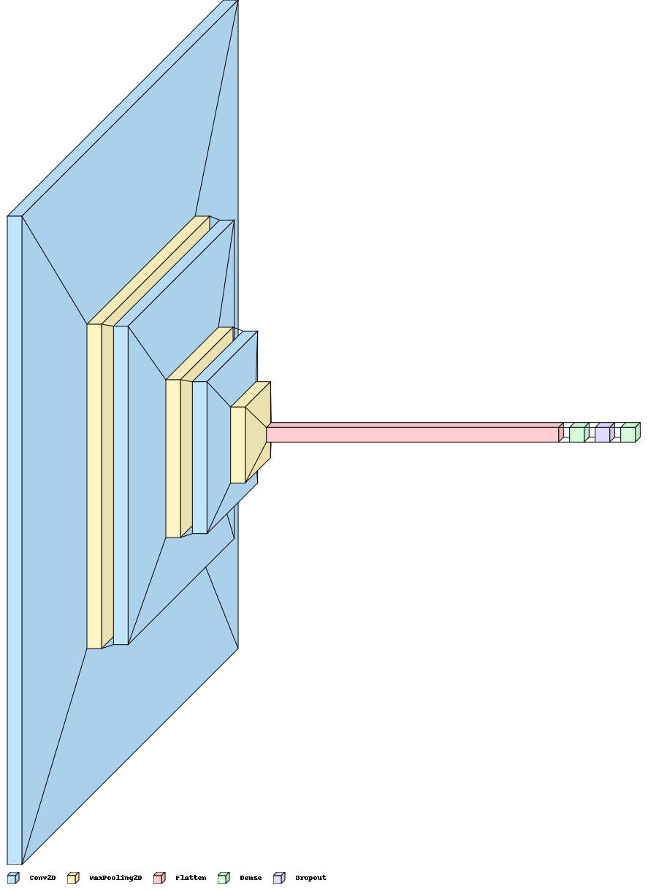

# FokusIn-model

## Overview
We built machine learning model that can detect the users level of focus in the learning process both online lectures and asynchronous activities such as watching course videos so that users can find out how high the user's resilience is and what factors make the user distracted. We used object detection approach using eye gaze dataset.

## Dataset Resources
[Columbia Gaze Data Set](https://www.cs.columbia.edu/CAVE/databases/columbia_gaze/)

## Model Buildings Notebook
[Focus Detection](https://colab.research.google.com/drive/1PWuEJlyRO1hnscVo-E7-hZraAY1j1S1o#scrollTo=Xx7n0tT2VdN8)

## Model Architecture

