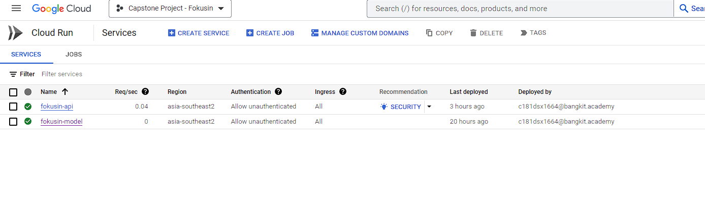
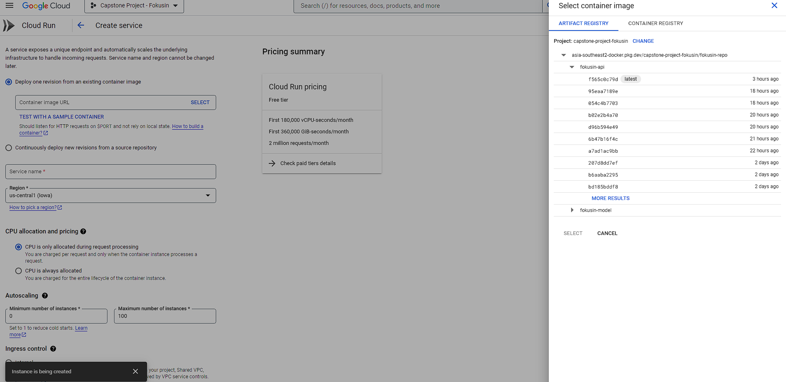
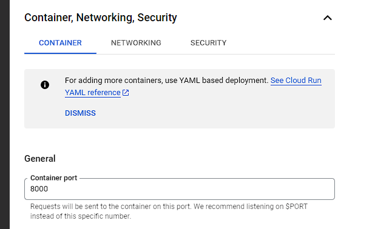

# FokusIn-model
Repository for FokusIn Machine Learning Deployment.

## Overview
We built machine learning model that can detect the users level of focus in the learning process both online lectures and asynchronous activities such as watching course videos so that users can find out how high the user's resilience is and what factors make the user distracted. We used object detection approach using eye gaze dataset.

## Dataset Resources
[Columbia Gaze Data Set](https://www.cs.columbia.edu/CAVE/databases/columbia_gaze/)

## Model Buildings Notebook
[Focus Detection](https://colab.research.google.com/drive/1PWuEJlyRO1hnscVo-E7-hZraAY1j1S1o#scrollTo=Xx7n0tT2VdN8)

## Model Architecture


### Powered by
- Flask
- Cloud Run

### Endpoint
#### Request
```json
POST: /predict
Payload:
{
  "image_url": < link to image >
}
```
#### Response
```json
{
    "predict_image": < confidence that the person in the image is focused. Between 0.0 - 1.0 >
}
```

## Development Guide

1. Save you model in ```.h5``` format as ```fokusin_model.h5```. 
2. For local deployment, run
```shell
py -m venv env
env/Script/Activate
pip install -r requirements.txt
flask run
```
Hit Ctrl+C to stop the server. 

## Deployment Guide
1. To deploy on GCP Cloud run, dockerize the application and push it to the Artifact Registry. Create a repository on artifact registry. 
2. Build and push the image. A ```Dockerfile``` is already provided.
```
docker build -t [your-zone]-docker.pkg.dev/[project-id]/[repo-name]/fokusin-model .
docker push [your-zone]-docker.pkg.dev/[project-id]/[repo-name]/fokusin-model
```
3. Create a cloud run service. Press create service on the Cloud Run dashboard.

4. Select the image you just pushed.

5. Expand "Container, Networking, Security". Set the Container Port to 8080. Configure other settings if needed.

6. Press create when you're ready. All traffic should be served immediately.